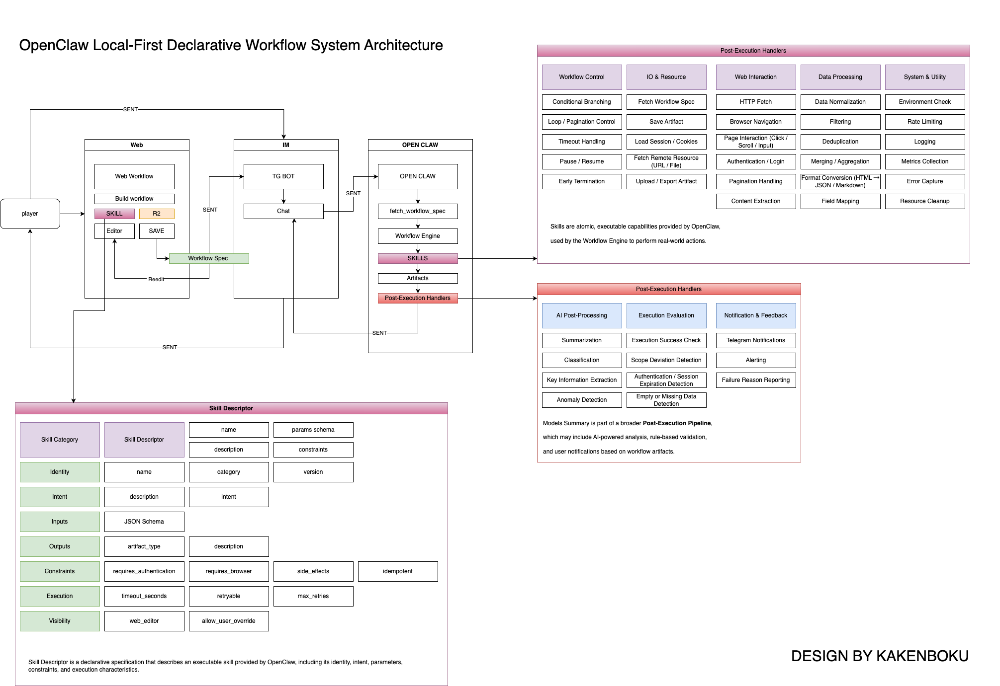

# OpenClaw 本地优先声明式工作流系统架构

## 项目简介

OpenClaw 是一个本地优先的声明式工作流系统，支持通过 Web 端配置工作流，通过 IM（如 Telegram Bot）投递任务，在本地 OpenClaw 执行端运行，并将结果反馈给用户。

## 文档

- [中文文档](./read-cn.md) - 完整的系统架构说明（中文）
- [English Documentation](./read-en.md) - System Architecture Documentation (English)

## 架构图

## 核心特性

- **本地优先**：所有执行在本地 OpenClaw 端完成，保护数据隐私
- **声明式配置**：通过 Web 端可视化配置工作流，生成 Workflow Spec
- **多渠道投递**：支持通过 IM（Telegram Bot）等渠道投递任务
- **技能化架构**：模块化的技能系统，支持流程控制、Web 交互、数据处理等
- **执行后处理**：支持 AI 分析、质量评估和通知告警

## 系统架构

### 整体链路

1. **player → Web**：用户在 Web 端配置工作流
2. **Web → IM (SENT)**：将工作流配置投递到即时通讯渠道
3. **IM → OPEN CLAW (SENT)**：TG Bot 将任务转发给本地执行端
4. **OPEN CLAW → IM / player (SENT)**：执行端把结果回传到 IM，用户查看

### 主要组件

- **Web**：工作流配置与生成 Workflow Spec
- **IM**：任务投递与交互通道
- **OPEN CLAW**：本地执行域，包含工作流引擎和技能集合
- **Post-Execution Handlers**：执行后处理管线

## 技能分类

- **Workflow Control**：流程控制类（条件分支、循环、超时处理等）
- **IO & Resource**：输入输出与资源类
- **Web Interaction**：网页交互类（HTTP 拉取、浏览器导航、页面交互等）
- **Data Processing**：数据处理类（规范化、过滤、去重、格式转换等）
- **System & Utility**：系统与稳定性类（环境检查、限流、日志等）

## License

本项目采用开源许可证（具体许可证待定）

## 贡献

欢迎提交 Issue 和 Pull Request！
